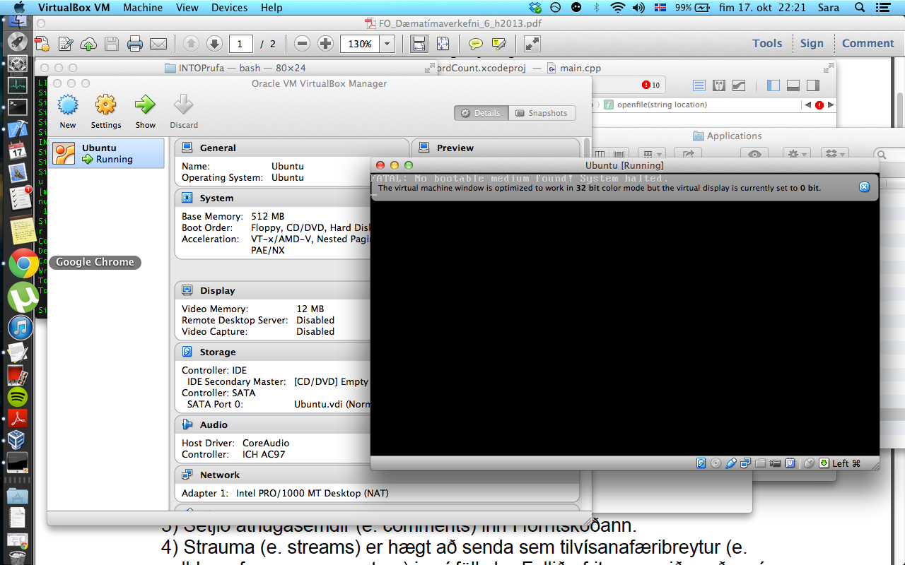

#Open Source

<ul>
<li>Sigríður Sara Ingvarsdóttir/li>>
</ul>

## 1. Linux uppsetning

Mér gekk ekki vel að setja upp Linux, því miður. Ég náði mér í Virtual Box vandræðalaust og þá .iso skrá fyrir Linux Mint, en ekkert gekk hjá mér ad "mounta" skrána í Virtual Box. Sama hvad eg reyndi tha virtist ekkert gerast (bara svartur skjár). Eg reyndi lika ad saekja Ubuntu en tha var sama sagan.
Sjá mynd:  

## 2. Uppsetning á vim && git

Mér gekk vel að setja bæði tólin upp, en hvort tveggja sótti ég mér einfaldlega af netinu með hjálp Google.

## 3. Unnið með Git (1. hluti)

Mér gekk vel ad forka NIM.cpp skrána. Það tók mig nokkrar tilraunir að bæta við skrána og uppfæra hana inn á github, en það tókst. Hér er tengill að minni útgáfu https://github.com/sigriduri13/INTOPrufa.git

## 4. Uppsettur hugbúnaður

VLC  
GNU General Public license  
http://www.videolan.org/vlc/download-sources.html

Mozilla Firefox  
Mozilla Public license  
https://developer.mozilla.org/en-US/docs/Developer_Guide/Source_Code/Downloading_Source_Archives?redirectlocale=en-US&redirectslug=Mozilla_Source_Code_%28HTTP%2FFTP%29

Arduino  
Creative Commons Attribution Share-Alike license  
http://arduino.cc/en/main/software#toc6

## 5. Unnið með Git (2. hluti)

Ég skal alveg játa að það tók mig smá tíma að setja mig inn í skipanirnar fyrir git, en þegar það var komið þá gekk þetta vandræðalaust fyrir sig. Leiðbeiningarnar á github komu sér vel. Fannst dálítið snúið að finna út úr því hvernig myndin átti að koma inn, en með hjálp Facebook hópsins hefur það tekist.
